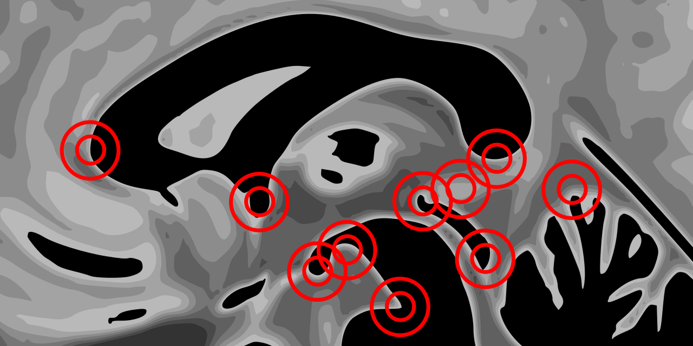
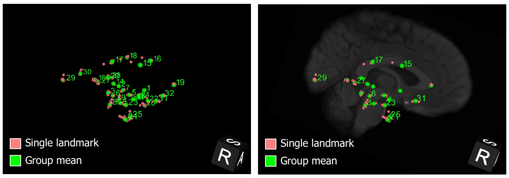

# AFIDs

An open framework for evaluating correspondence in brain images and teaching neuroanatomy using anatomical fiducial placement

[](./docs/img/afids_cover_for_github.png)

**Documentation:** https://afidsproject.com

**Join our channel:**  <a href="https://mattermost.brainhack.org/brainhack/channels/afids" target="_blank"></a>

## Introduction

* The AFIDs protocol is an anatomical fiducial placement protocol that has been validated and used for teaching at a number of local and global BrainHack related events.
    * <a href="https://afidsproject.com/afids_protocol/human_protocol.html" target="_blank">Human AFIDs protocol</a>
    * <a href="https://afidsproject.com/afids_protocol/macaca_protocol.html" target="_blank">Macaca AFIDs protocol</a>
* The protocol and study framework leverage open resources/tools and has been developed with full transparency in mind so that others may freely use, adopt, and modify.
* AFID placement is reproducible, not overtly manually intensive (20-40 minutes once trained), and more sensitive to local registration errors than standard voxel overlap measures.
* 60+ raters trained to date.

<center></center>

## Requirements

* dcm2niix (v1.0.20200427)
* python requirements (defined in `requirements.txt`):
    * PyYAML>=5.3.1
    * scikit-learn>=0.23.1
    * nibabel>=3.1.0
    * pandas>=1.0.5
    * numpy>=1.19.4

## Input directory structure

The input directory with `*_T1w.nii.gz` and AFIDs `.fcsv` files should be setup as follows:

```sh
input_data/
    ├── sub-<###>_*.fcsv
    ├── sub-<###>_*T1w.nii.gz
    └── ...
```

* `.fcsv` is the 3D Slicer markups file with all 32 AFIDs defined for the relative T1w image
* `T1w.nii.gz` is the T1w nifti file associated with the AFIDs markups

## Configuration

Edit the `config/config.yaml` file to include the paths to the following:

<center>

|Variable   |Description        |
|:----------|:------------------|
| `input_dir` | full path to where the input directory is stored   |
| `output_dir`   | full path to where the pipeline should output the data   |
| `c3d_path`  | path to the `c3d` install `bin` directory on your system |

</center>

## Running locally

1. Clone a copy of this repository to your system:

    ```sh
    git clone https://github.com/greydongilmore/autofids-brainhack2020.git
    ```

2. Install the Python dependencies by opening a terminal, changing to the project directory and running:

    ```sh
    python -m pip install -r requirements.txt
    ```

### Local run

All the following commands should be run in the root of the project directory.

1. Convert source `.fcsv` files into a 3D mask using c3d:

   ```sh
   python /workflow/scripts/fcsvToLandmarks.py
   ```

2. Running the training pipeline:

   ```sh
   python /workflow/scripts/c3dTrain.py
   ```

3. Running the testing pipeline:

   ```sh
   python /workflow/scripts/c3dTest.py
   ```

